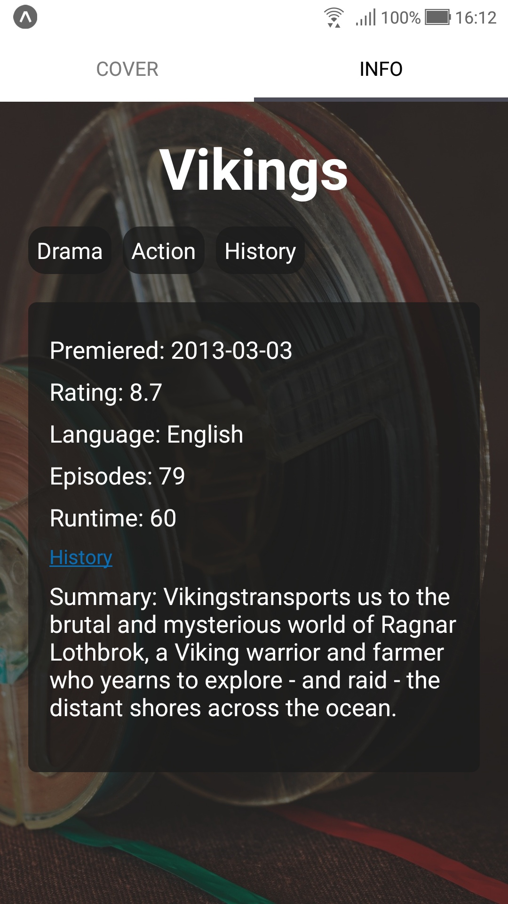
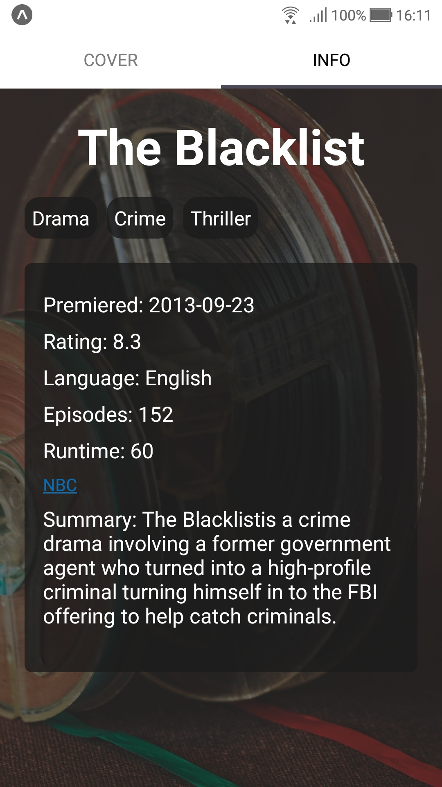

# Show Info (app)

Trabalho Final da disciplica Programação para Dispositivos Móveis

Aplicativo para vizualizar informações de séries utilizando a API [TVmaze](https://www.tvmaze.com/api)

---

 
 

---

## Requerimentos

Node, Yarn, Expo

## Como instalar as dependências e executar o projeto

Abra o Terminal/Console e execute `yarn`, e depois `expo start`

## Dependências utilizadas

React Navigation, React-navigation/stack, React-native-tab-view, Axios, Styled-components
